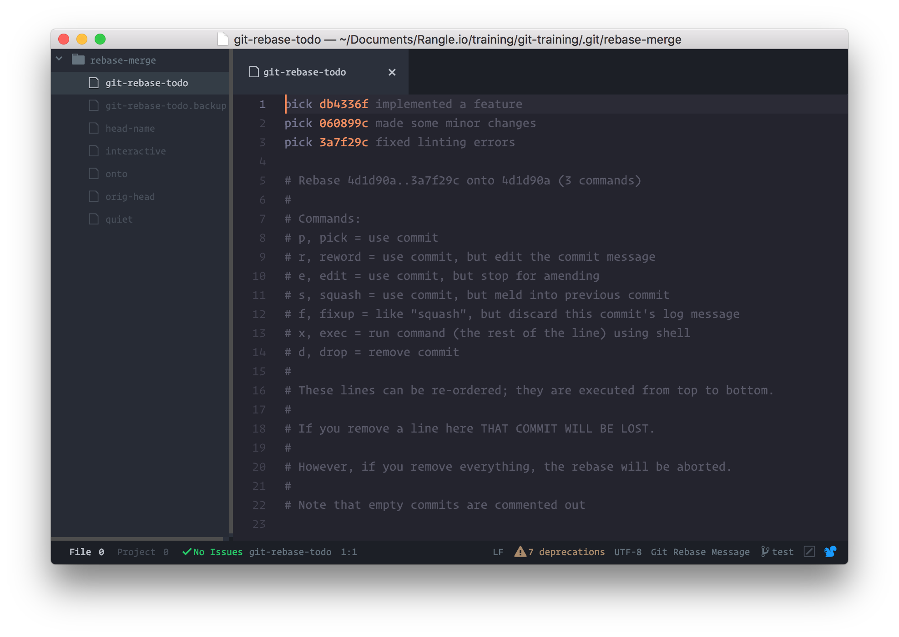
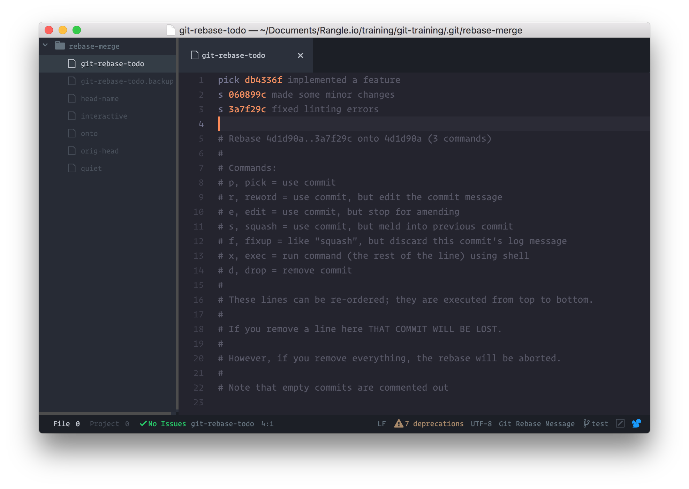
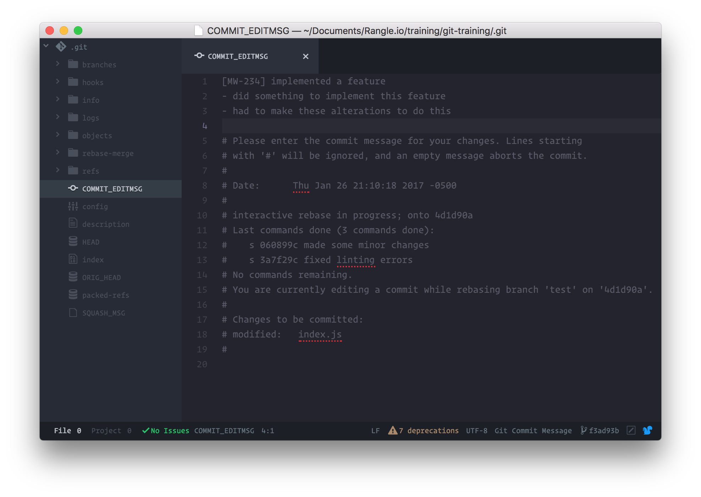
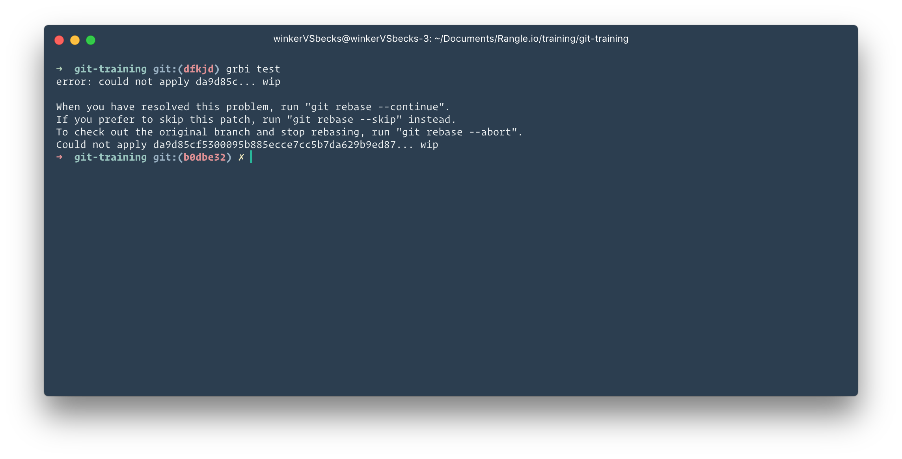

# Rebase

### What is a rebase?

Assume the following git history where you are working on the `my-feature` branch.

```
          A---B---C my-feature
         /
    D---E---F---G master
```

After `git rebase master` this would become:

```
                  A'--B'--C' my-feature
                 /
    D---E---F---G master
```

- `git rebase origin/master` rebases your current branch against master
- `git rebase -i origin/master` is the interactive version which allows you to do things such as squishing commits.


### Workflow

This is assuming:

1. There is only one remote i.e., all your team is working in one repository.
2. You are currently on a feat/chore/fix branch and not on `master`.

```
git fetch origin
git rebase -i origin/master
```

At this point the editor will launch and will allow you to pick commits for squashing:



We are going to squash all commits into one. Leave the first commit untouched and convert all the other `pick`s into `squash` or `s`. Save and close the editor window.



If no conflicts were encountered the rebase will complete and you move to the final step. Your editor will open up again. This time it shows you the messages from the various commits that are going to be squashed. Here you get a chance to compose the message for the new squashed commit. 

- Use a descriptive commit message.
- If you have a Pivotal Tracker, JIRA, or Github issue number for the feature, reference it in the commit.


Save and close the editor window once you have composed a new git message.



At this point the rebase is complete 🎉 Last step, push your changes to remote.

```
git push origin my-feature -f
```

Yes, that's a force push there. Because you have successfully re-written git history. Where you previously had multiple commits you now only have one commit.
 

### Resolving Conflicts

During the rebase process you might encounter conflicts.



Relax. Take a deep to breath. We can deal with this. 💪

Start by running `git status` this will show you a list of files that have conflicts. Go through them one by one and resolve conflicts.

The conflicts show up something like this (there can be more than one in a file):

```diff
  This is the first line
  This is the second line
  This is the third line I added
<<<<<<< HEAD
  Someone else added this line
  Someone else added this line too
=======
  This is the fourth line I added
  This is the fifth line I added
>>>>>>> f78d8ae... <commit message> 
```

Here everything between `<<<<<<< HEAD` and `=======` is stuff that is in the `master` branch. And everything between `=======` and `>>>>>>> f78d8ae... <commit message>` is your on the `my-feature` branch. Git could not automatically merge these so it wants you to decide how these lines should be merged. 

You can pick `master` version or your version depending on what you were implementing. You are the best judge here. Sometimes the correct answer will be a combination of the two.

Pick the appropriate combination and delete the conflict markers (`<<<<<<< HEAD`, `=======`, etc).

```diff
  This is the first line
  This is the second line
  This is the third line I added
  Someone else added this line
  This is the fourth line I added
  This is the fifth line I added
```

Do the same for all the other files with conflicts. Then:

1. Stage the changes by executing `git add <file-name>`
2. Continue the rebase `git rebase --contine`

If you messed something up you can always `git rebase --abort`.


Remember to rebase early and often. This will prevent messy merge conflicts. 
